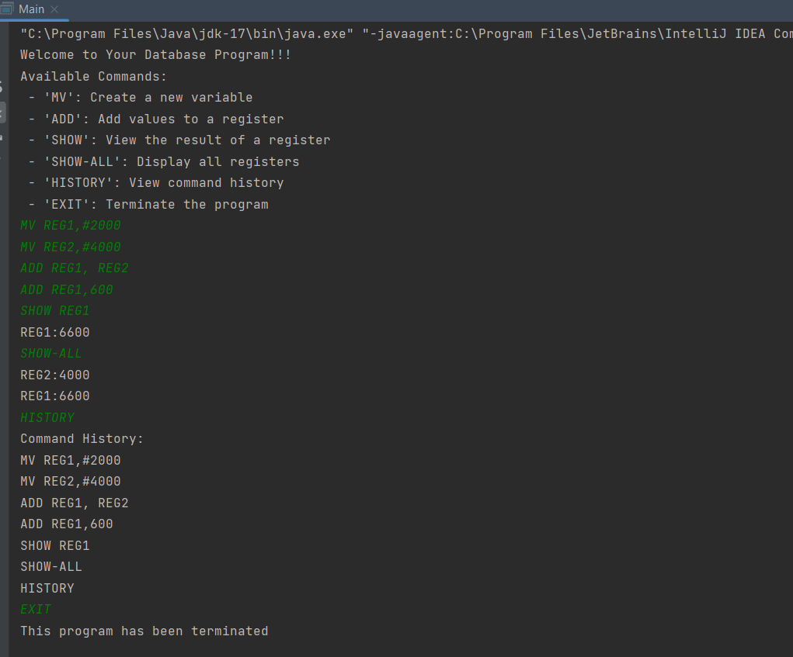

<h1 align = "center"> Assembly Language </h1>


A simple assembly language simulator written in Java. The program allows users to execute assembly language instructions, manipulate registers, and persistently store register values.

## Technical Stack Used
- ArrayList

## Getting Started
1. Clone the repository or download the source code files.
2. Open the project in your preferred Java development environment.
3. Compile and run the Main.java file to start the program.

## Usage
1. Upon running the program, a menu of commands will be displayed.
2. Available commands:
- MV: Make a new variable
 ```
 For e.g:
MV REG1,#2000
MV REG2,#4000
 ```
 The above statements will create registers named REG1 and REG2 and initialize their value by 2000 and 4000 respectively.
- ADD: Add the values of registers
```
For e.g:
ADD REG1,REG2
ADD REG1,600
```
In the first instruction of the above statements will add the values of REG1 and REG2 and store the sum in the first variable.
Similarly, in the second instruction, the value 600 will be added in the register REG1.
- SHOW: See the result of a register
```
For e.g:
SHOW REG1
SHOW REG2
```
The above statements will show the value present in the corresponding registers.
- SHOW-ALL: Display all the registers
- EXIT: Terminate the program
- HISTORY: View command history

3. Enter the desired command and follow the prompts to perform operations on registers.
4. The current register values are stored in a file named registerValues.txt.
5. The program will continue running until the user enters the EXIT  command.

## File Descriptions
- Main.java: Contains the main method and program flow.
- AssemblyProgram.java: Represents the assembly program logic.
- Instruction.java: Defines an assembly instruction with an operation and operands.
- Operation.java: Enumerates the available operations in the assembly program.

  Here is Output:



